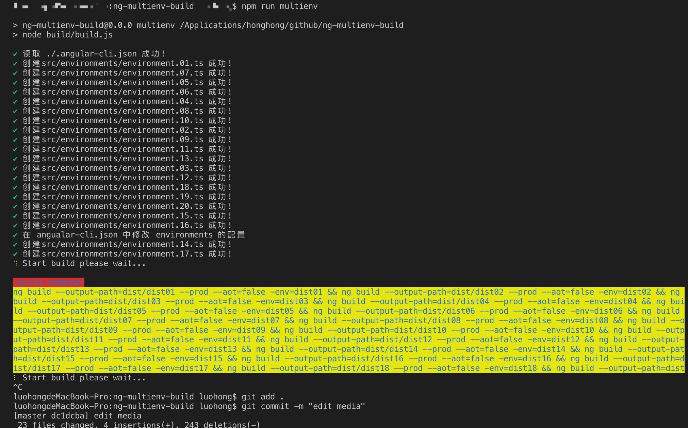

# NgMultienvBuild
English | [简体中文](https://github.com/luohong123/ng-multienv-build/blob/master/README.md) 

<p>


</p>

# Foreword
Foreword The original intention of writing this script is because the company made an intranet project based on Angular5, a set of code, 10-20 different background service environments, each time you upgrade the project, you need to modify the environment file, one by one, the ng build command. Packing for a long time, the idea of this script is to put the background service address, server name and other variables into an array, without modifying the configuration under the environment folder and the angular-cli.json file, only need to manage this array, dynamically create The enviroment.ts file and the modified angular-cli.json file, running the `npm run multienv` command, can package 20 different environment configurations at once.


# Start
After cloning the project, execute the following command
```bash
npm install
```
Maintain environment configuration in `build/environments.config.js`

Execute the following command to start a one-button package multi-environment
```bash
npm run multienv
```
